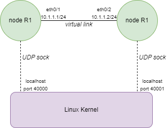
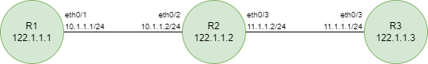

# Content
Some personal c/c++ projects for fun

- [Tic-Tac-Toe with Minimax](#tic-tac-toe-with-minimax)
- [Mines Weeper](#mines-weeper)
- [Virtual Network](#virtual-network)
- [Homemade TCP Socket](#homemade-tcp-socket)


# Tic-Tac-Toe with Minimax

This is a console-based implementation of the Tic-Tac-Toe game written in C, featuring an 'AI' opponent powered by the Minimax algorithm.

### Features

- Play against the computer opponent using the Minimax algorithm.
- Two players can also play against each other.
- The game board is displayed after each move.
- The program validates player moves and prevents invalid moves.
- The program detects when a player wins or when the game ends in a draw.

### How to Play

- When the game starts, the empty Tic-Tac-Toe board will be displayed.
- Player 1 is assigned the symbol 'O', and Player 2 (or the computer AI) is assigned the symbol 'X'.
- Players take turns entering the position where they want to place their symbol.
- Positions are entered as row and column numbers separated by a space.
  - Valid row and column numbers are 0, 1, or 2.
  - For example, to place a symbol in the top-right corner, enter 0 2.
- After each move, the updated board will be displayed.
- The program will determine if a player wins or if the game ends in a draw.

### The minimax algorithm

The Minimax algorithm is a decision-making algorithm commonly used in game theory. It is often applied to games with two players, where one player aims to maximize their outcome, and the other player aims to minimize it.

the Minimax algorithm considers all possible moves by the computer player (Max) and the human player (Min). It assigns scores to terminal states (win, loss, or draw) and selects the move that maximizes the computer player's score while assuming that the human player will also make optimal moves.

The score for a win is 10 minus the number of moves to reach the winning state, for a loss the score is -10 plus the number of moves, for a draw the score is 0.


# Mines Weeper

This is a Minesweeper game implemented using CSFML (C Simple and Fast Multimedia Library).


Minesweeper is a classic single-player puzzle game where the objective is to clear a rectangular board without detonating any hidden mines. The board is divided into cells, some of which contain mines. The player must uncover cells to reveal numbers indicating the number of adjacent mines. Using this information, the player can deduce the locations of mines and mark them to avoid detonation. The game is won when all non-mine cells are uncovered.


### Features

- 20 by 20 grid with 40 randomly hidden mines
- revealing a cell without an adjacent mine will recursively reveal adjacent cells as well
- Flag system to mark cells
- When the game ends, another one starts after a mouse click.

### How to Play

You need the CSFML library installed or you can include it at the build.

```
cd Minesweeper
gcc -Wall -g -o mines_weeper mines_weeper.c -lcsfml-graphics -lcsfml-window -lcsfml-system
./mines_weeper
```

- Left-click: Reveal a cell
- Right-click: Mark a cell as a mine (right click again to remove the flag)

Game assets designed by Kia https://kia.itch.io/16x16-tileset-for-minesweeper


# Virtual Network

Implementation of a virtual network in C that simulates the exchange of packets between nodes. This project is based on the online video course from udemy.
The purpose is to understand level 2 and 3 network protocols in more detail

### Features

- MultiNode Topology Emulation of Routers and Switches
- Implementation of the DataLink Layer (L2 routing), including ARP
- L2 Switching (Mac-based Learning and Forwarding)
- Vlan Based Mac learning and Forwarding
- Network Layer (L3 routing)
- A CLI to manage the topology (add routes, resolve arp, ping a node, show the entire topology, display arp tables, display mac tables, display route tables..)


Main supported commands :
```
show topology

show node <node-name> arp   // for arp table
show node <node-name> rt    // for route table
show node <node-name> mac   // for mac table

run node <node-name> resolve-arp <ip-address>
run node <node-name> ping <dest-ip-address>

config node <node-name> route <subnet-ip> <subnet-mask> <gateway-ip-address> <interface>
```

### How it works

Communication between the nodes of the virtual network is via udp sockets. Each node is allocated a loopback port. When a packet has to cross a virtual link between two nodes, the packet is transmitted by the Linux kernel via the sockets.



Exemple of a topology of two nodes R1 and R2. If R1 wants to send a packet via the eth0/1 interface the packet is encapsulated by an udp socket which sends it to localhost 40001. To know from which interface a node has received a packet, an additional data is added in front of the packet to specify the receiving interface.

### How to use it

First, you need to choose or build a topology. Already built topologies can be found in `topologies.c`. Then you simply need to specify in `testapp.c` the name of the topology you want to load. By default, a linear topology of 3 routers is loaded.




In this linear topology, you may want to ping R3 from R1. As on-demand ARP resolution is not supported, you must manually execute the ARP resolution commands. In addition, you need to add the routes to forward the packet at Layer 3.

To launch the app
```
make clean
make
sudo ./test.exe
```

In the app CLI
```
run node R1 resolve-arp 10.1.1.2
run node R2 resolve-arp 11.1.1.1
config node R1 route 122.1.1.3 32 10.1.1.2 eth0/1
config node R2 route 122.1.1.3 32 11.1.1.1 eth0/3

run node R1 ping 122.1.1.3
```


# Homemade TCP Socket

This is still a WIP project !

The goal is to build from scratch a full TCP/IP stack linked to local TAP interface to support a TCP socket. Unlike the Virtual Network project, the packets will travel on the real network system !

To create the TAP interface and route the traffic:

```
sudo ip tuntap add name tap0 mode tap
sudo ip link set dev tap0 up
sudo ip route add <ip-address> dev tap0
```