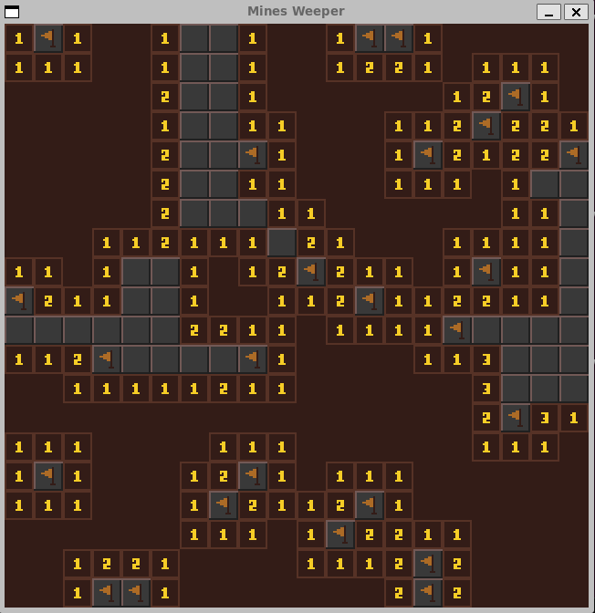

# Content
Some personal c/c++ projects for fun

- [Tic-Tac-Toe with Minimax](#tic-tac-toe-with-minimax)
- [Mines Weeper](#mines-weeper)
- 


# Tic-Tac-Toe with Minimax

This is a console-based implementation of the Tic-Tac-Toe game written in C, featuring an 'AI' opponent powered by the Minimax algorithm.

### Features

- Play against the computer opponent using the Minimax algorithm.
- Two players can also play against each other.
- The game board is displayed after each move.
- The program validates player moves and prevents invalid moves.
- The program detects when a player wins or when the game ends in a draw.

### How to Play

- When the game starts, the empty Tic-Tac-Toe board will be displayed.
- Player 1 is assigned the symbol 'O', and Player 2 (or the computer AI) is assigned the symbol 'X'.
- Players take turns entering the position where they want to place their symbol.
- Positions are entered as row and column numbers separated by a space.
  - Valid row and column numbers are 0, 1, or 2.
  - For example, to place a symbol in the top-right corner, enter 0 2.
- After each move, the updated board will be displayed.
- The program will determine if a player wins or if the game ends in a draw.

### The minimax algorithm

The Minimax algorithm is a decision-making algorithm commonly used in game theory. It is often applied to games with two players, where one player aims to maximize their outcome, and the other player aims to minimize it.

the Minimax algorithm considers all possible moves by the computer player (Max) and the human player (Min). It assigns scores to terminal states (win, loss, or draw) and selects the move that maximizes the computer player's score while assuming that the human player will also make optimal moves.

The score for a win is 10 minus the number of moves to reach the winning state, for a loss the score is -10 plus the number of moves, for a draw the score is 0.


# Mines Weeper

This is a Minesweeper game implemented using CSFML (C Simple and Fast Multimedia Library).


Minesweeper is a classic single-player puzzle game where the objective is to clear a rectangular board without detonating any hidden mines. The board is divided into cells, some of which contain mines. The player must uncover cells to reveal numbers indicating the number of adjacent mines. Using this information, the player can deduce the locations of mines and mark them to avoid detonation. The game is won when all non-mine cells are uncovered.



### Features

- 20 by 20 grid with 40 randomly hidden mines
- revealing a cell without an adjacent mine will recursively reveal adjacent cells as well
- Flag system to mark cells
- When the game ends, another one starts after a mouse click.

### How to Play

You need the CSFML library installed or you can include it at the build.

```
cd Minesweeper
gcc -Wall -g -o mines_weeper mines_weeper.c -lcsfml-graphics -lcsfml-window -lcsfml-system
./mines_weeper
```

- Left-click: Reveal a cell
- Right-click: Mark a cell as a mine (right click again to remove the flag)

Game assets designed by Kia https://kia.itch.io/16x16-tileset-for-minesweeper